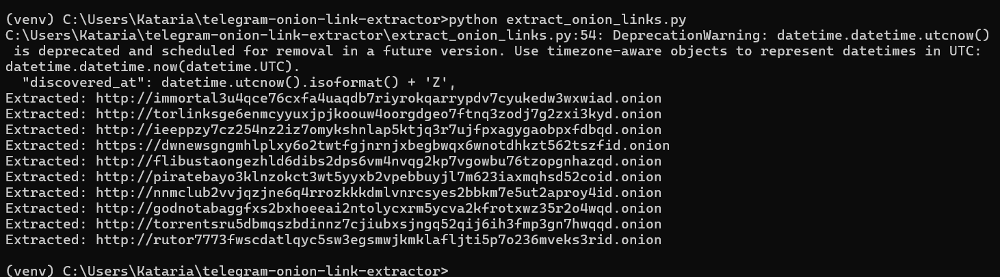

# 🧅 Telegram .onion Link Extractor

A Python script that extracts `.onion` links from Telegram messages using the Telegram API via Telethon.

---

## ⚙️ Setup Instructions

1. **Clone this repository**:

   ```bash
   git clone https://github.com/Hillfoul007/telegram-onion-link-extractor.git
   cd telegram-onion-link-extractor
   ```

2. **Install dependencies**:

   ```bash
   pip install -r requirements.txt
   ```

3. **Configure Telegram API keys**:  
   Replace `api_id` and `api_hash` in `extract_onion_links.py` with your credentials from [https://my.telegram.org](https://my.telegram.org).

---

## 🚀 Usage

```bash
python extract_onion_links.py
```

You will be prompted to enter a channel name and number of messages to scan.  
It will print all found `.onion` links from recent messages.

---

## 💡 Sample Output

```
Found 2 .onion link(s):
http://example1abcxyz.onion
https://darkmarket12345.onion
```

---

## 🖼️ POC Screenshot



---

## 📝 Explanation

This tool scans recent messages in any public Telegram channel and extracts `.onion` URLs using a regex match. It can help in cybersecurity investigations or content filtering research.

---

## 📄 License

MIT License
